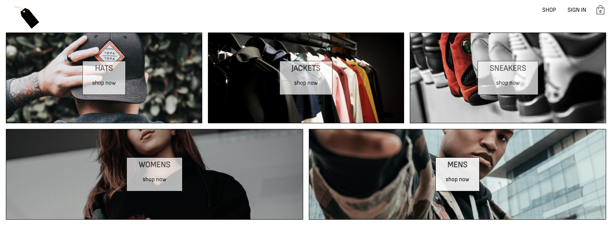
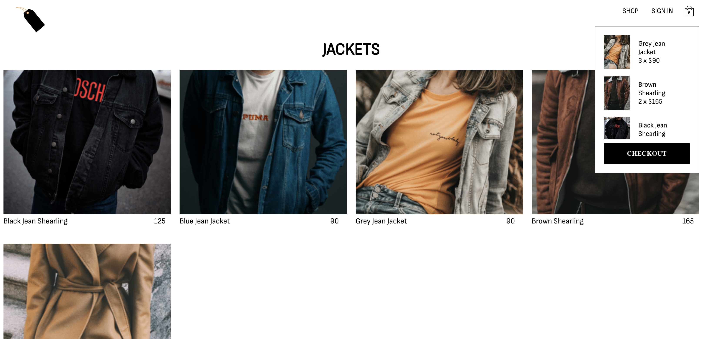
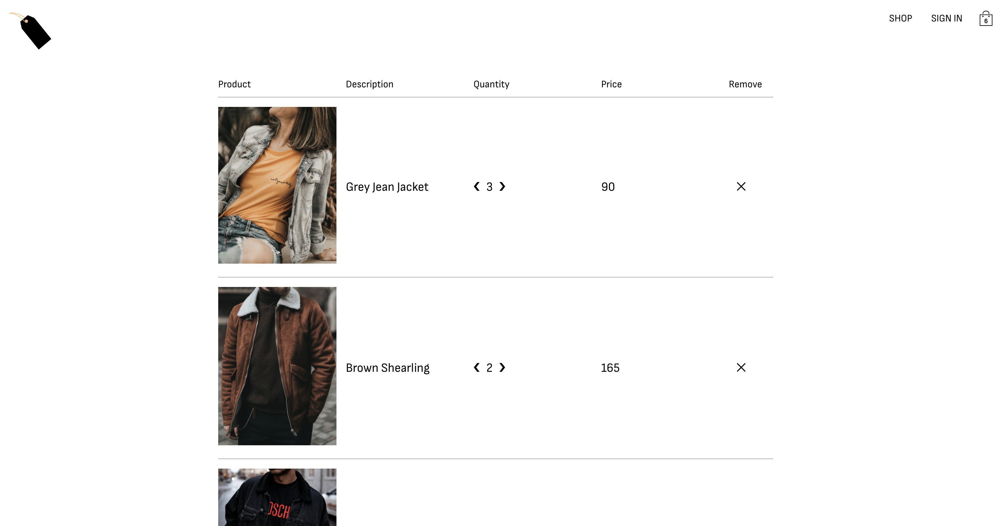
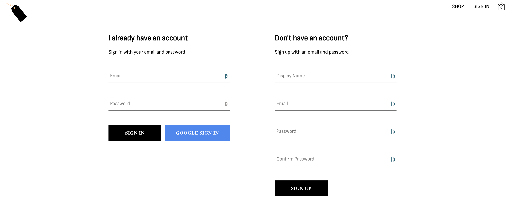

# 👕 Kracz Clothing Co. 👕

Welcome to the repository for Kracz Clothing Co., a comprehensive digital storefront built with React, Firebase, Redux, Redux-Saga, and Styled Components. Users can browse clothing by category, add them to their cart, and check out.

## 🛍️ Features

-   **Browse Products**: Users can navigate through different clothing categories to discover items.
-   **Shopping Cart**: Users can add products to their shopping cart, view cart total, item quantity and cost, and make updates directly from the cart.
-   **User Authentication**: Users can create a store account and sign in, preserving their carts and their information across sessions.

## 🏗️ Built With

-   **React**: The entire front-end is developed with unique React components, showcasing a clear understanding of component-based architecture.
-   **Firebase Auth & Firestore**: User authentication and data storage are handled by Firebase Auth and Firestore, ensuring secure and reliable user sessions.
-   **Redux & Redux-Saga**: State management in the application is handled by Redux with asynchronous actions managed by Redux-Saga.
-   **Styled Components**: A modern approach to CSS, allowing scoped styles in React with ease and simplicity.
-   **Netlify**: The project is hosted on Netlify for seamless deployment and hosting.

## 🚀 Deployment

The application is live and can be viewed [here](https://kraczclothingco.netlify.app/).

## 📬 Contact

Feel free to raise issues, contribute to the project or connect with me via email: [joseph.kracz@gmail.com](mailto:joseph.kracz@gmail.com).

Enjoy your shopping experience with Kracz Clothing Co!

